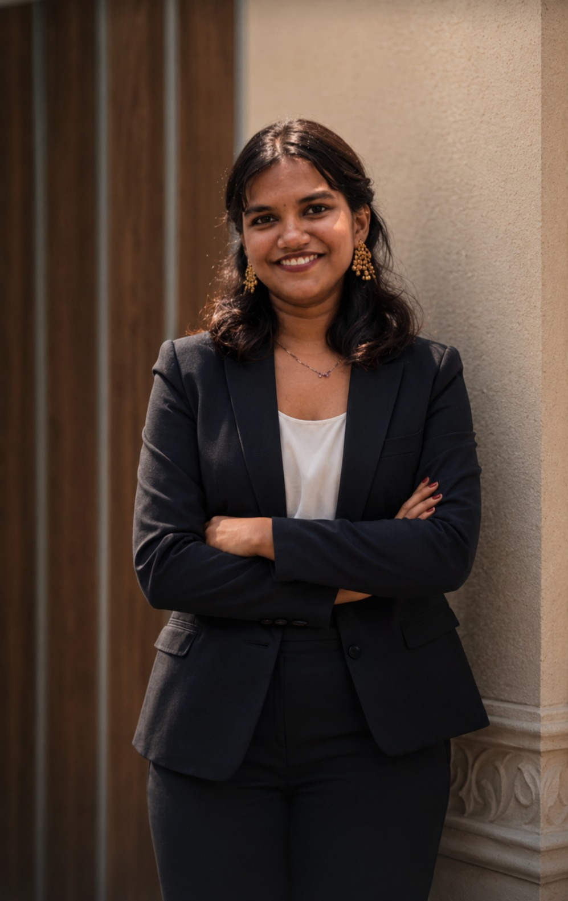

# Hi, I'm Amritha Lal 👋

### B.Tech Computer Science & Engineering Student | Software Developer | Flutter & UI/UX Enthusiast

Building practical software projects, designing intuitive user experiences, and continuously learning modern technologies.

 

<a href="https://www.linkedin.com/in/amritha-lal-8558aa262"> &emsp;&emsp;&emsp; <a href="https://github.com/AMRITHA-LAL"> &emsp;&emsp;&emsp; <a href="https://amritha-lal.github.io/amritha_portfolio/"> 
 &emsp;&emsp;&emsp;  &emsp;&emsp;&emsp;  
<b>CONNECT →</b> &emsp;&emsp;&emsp; <b>FOLLOW →</b> &emsp;&emsp;&emsp; <b>VISIT →</b>
</a>

---

# 👩‍💻 About Me

I am a **B.Tech Computer Science & Engineering** student with a Diploma background in Computer Engineering.

I enjoy designing and developing software applications while continuously improving my skills through hands-on projects.

My current interests include:

- 💻 Software Development
- 🌐 Web Development
- 📱 Flutter Application Development
- 🎨 UI/UX Design
- 🤖 Artificial Intelligence
- ⚡ Modern Software Technologies

I believe the best way to learn is by building real projects and documenting the complete development journey—from design to implementation.

---

# 🛠 Technical Skills

## Programming Languages

- Python
- JavaScript
- Dart

## Web Development

- HTML5
- CSS3
- JavaScript

## Mobile Development

- Flutter
- Dart

## UI / UX

- Figma
- Material Design

## Tools & Technologies

- Git
- GitHub
- Visual Studio Code
- Android Studio
- AI Tools

---

# 🚀 Featured Projects

## 🌊 TIDE AI

AI-inspired Productivity & Task Management Mobile Application.

### Highlights

- Flutter application
- Figma UI/UX prototype
- Firebase integration
- AI-inspired productivity assistant
- Professional GitHub documentation
- Dedicated project page in portfolio

**Tech Stack**

Flutter • Dart • Firebase • Figma

🔗 Repository

https://github.com/AMRITHA-LAL/TideAI

🔗 Project Details

https://amritha-lal.github.io/amritha_portfolio/tideai.html

---

## 💰 SpendWise (UI/UX)

Modern Personal Finance Management Application.

Currently designing a complete UI/UX prototype in Figma before Flutter development.

### Planned Features

- Expense Tracking
- Budget Planning
- Savings Goals
- Financial Analytics
- Wallet Management
- Smart Insights
- AI-powered Finance Assistant

**Tech Stack**

Figma • Flutter (In Progress)

---

## 🌐 Personal Developer Portfolio

A responsive portfolio website showcasing my projects, UI/UX designs, technical skills, and learning journey.

### Features

- Responsive design
- Embedded Figma prototypes
- Dedicated project pages
- GitHub repository showcase
- Learning journey
- Contact information

**Tech Stack**

HTML • CSS • JavaScript • GitHub Pages

🔗 Live Portfolio

https://amritha-lal.github.io/amritha_portfolio/

🔗 Repository

https://github.com/AMRITHA-LAL/amritha_portfolio

---

# 📚 Currently Learning

- Data Structures & Algorithms
- Flutter Development
- Advanced Python
- JavaScript
- Full Stack Development
- Software Engineering Practices
- UI/UX Design
- Git & GitHub Workflows

---

# 🎯 Goals

- Build impactful software projects
- Strengthen problem-solving skills
- Gain industry experience through internships
- Contribute to open-source projects
- Explore Artificial Intelligence applications
- Grow as a Software Engineer

---

# 📈 GitHub Stats

> *(You can add GitHub stats cards here later.)*

---

# 📫 Connect With Me

🌐 Portfolio

https://amritha-lal.github.io/amritha_portfolio/

💼 LinkedIn

https://www.linkedin.com/in/amritha-lal-8558aa262

💻 GitHub

https://github.com/AMRITHA-LAL

---

### ⭐ Thank you for visiting my profile!

Always learning, building, and improving.

